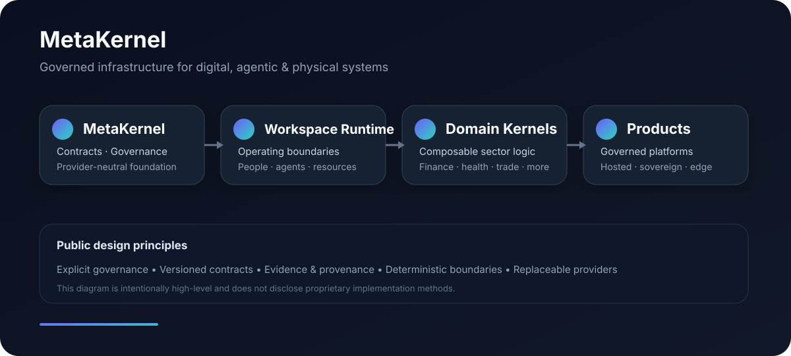

<div align="center">

# MetaKernel

### Governed infrastructure for digital, agentic & physical systems

**Portable · Provider-neutral · Evidence-aware · Composable**



</div>

---

<table>
<tr>
<td width="25%" align="center"><strong>MetaKernel</strong><br/><sub>governance foundation</sub></td>
<td width="25%" align="center"><strong>Workspace Runtime</strong><br/><sub>operating boundaries</sub></td>
<td width="25%" align="center"><strong>Domain Kernels</strong><br/><sub>sector composition</sub></td>
<td width="25%" align="center"><strong>Products</strong><br/><sub>governed platforms</sub></td>
</tr>
</table>

## What MetaKernel is

MetaKernel is a provider-neutral foundation for building systems that need explicit governance, machine-readable contracts, controlled execution, evidence, provenance, and portable deployment across hosted, sovereign, on-premises, edge, and disconnected environments.

It is designed to support **software, agents, data, devices, organisations, workspaces, and external providers** without making any one vendor or model the semantic center of the system.

<details>
<summary><strong>🧭 Explore the operating model</strong></summary>

<br/>

```text
MetaKernel
   ↓
Workspace Runtime Infrastructure
   ↓
Domain Kernels
   ↓
Governed Products & Platforms
```

The public model is intentionally high-level. Internal algorithms, state machines, resolution procedures, implementation sequences, and proprietary optimization methods are not published here.

</details>

<details>
<summary><strong>🧩 Core public principles</strong></summary>

<br/>

| Principle | Public meaning |
|---|---|
| Explicit governance | Authority and policy boundaries are deliberate rather than ambient |
| Canonical contracts | Important resources and interfaces are machine-readable and versioned |
| Provider neutrality | Infrastructure providers remain replaceable behind stable boundaries |
| Deterministic boundaries | Critical behavior can fail closed and be reproduced where required |
| Evidence & provenance | Material actions can be associated with verifiable records and lineage |
| Composability | Domain kernels and governed workspaces can be assembled without collapsing boundaries |
| Portability | The same architecture can target hosted, sovereign, edge, on-premises, and disconnected environments |

</details>

<details>
<summary><strong>🗺️ Where MetaKernel fits</strong></summary>

<br/>

**Foundational layer** → common governance and contract substrate  
**Runtime layer** → governed operating/workspace boundaries  
**Domain layer** → finance, healthcare, trade, industry, and other sector kernels  
**Product layer** → applications, platforms, developer infrastructure, and regulated systems

</details>

<details>
<summary><strong>🔌 Provider ecosystem</strong></summary>

<br/>

MetaKernel can integrate external engines, databases, policy systems, model runtimes, agent frameworks, browsers, document processors, observability systems, security tooling, and communications providers through replaceable interfaces and conformance boundaries.

**A provider is not the kernel.** Provider choice does not redefine MetaKernel semantics.

</details>

<details>
<summary><strong>🛡️ Public disclosure boundary</strong></summary>

<br/>

This organization profile is a **non-enabling, high-level product and architecture overview**. It intentionally does not publish proprietary algorithms, internal resolution procedures, implementation sequences, state machines, detailed data models, training methods, decision logic, optimization methods, or other confidential implementation details.

Detailed technical designs and implementation material are maintained in controlled repositories and design records.

</details>

---

### Current focus

Governed execution · Workspace Runtime Infrastructure · Domain kernels · Evidence/provenance · Provider-neutral integrations · Agentic systems · Portable regulated infrastructure

<div align="center">

**Build systems that can explain what they are, what they may do, and what they actually did.**

</div>
