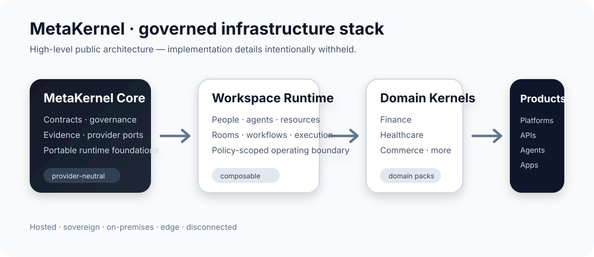
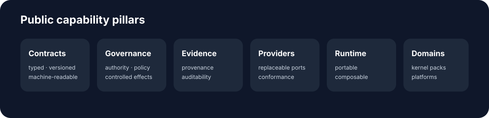

<div align="center">

# MetaKernel

### Governed infrastructure for digital, agentic, and physical systems

**Provider-neutral · portable · contract-driven · evidence-aware**

<br/>



<br/>

</div>



## Explore MetaKernel

<table>
<tr>
<td width="33%" valign="top">

### 🧭 Architecture
A layered foundation for composing governed runtimes, domain kernels, and products without hard-wiring infrastructure providers.

</td>
<td width="33%" valign="top">

### 🧩 Provider neutrality
Models, databases, policy engines, agent frameworks, browsers, document systems, and infrastructure providers remain replaceable behind defined interfaces.

</td>
<td width="33%" valign="top">

### 🧾 Evidence-aware systems
Material operations are designed to remain traceable, governed, and auditable across deployment environments.

</td>
</tr>
<tr>
<td valign="top">

### 🏢 Workspace runtime
A common operating boundary for people, organisations, agents, resources, rooms, workflows, and execution contexts.

</td>
<td valign="top">

### 🧱 Domain kernels
Reusable domain foundations can support finance, healthcare, commerce, property, and other regulated or operational sectors.

</td>
<td valign="top">

### 🌍 Portable deployment
Designed for hosted, sovereign, on-premises, edge, and disconnected deployment profiles.

</td>
</tr>
</table>

<details>
<summary><strong>▸ Public architecture model</strong></summary>

<br/>

```text
MetaKernel
   ↓
Workspace Runtime Infrastructure
   ↓
Domain Kernels
   ↓
Products · Platforms · APIs · Agents · Apps
```

This is intentionally a high-level public model. Internal algorithms, resolution procedures, implementation sequences, state machines, training methods, optimisation techniques, and other confidential implementation details are not published here.

</details>

<details>
<summary><strong>▸ Design principles</strong></summary>

<br/>

MetaKernel projects are developed around public architectural principles including:

- explicit governance, authority, and policy boundaries
- canonical and versioned resources and contracts
- provider-neutral ports and conformance boundaries
- deterministic and fail-closed behavior where appropriate
- evidence, provenance, lineage, and auditability
- portable execution across infrastructure environments
- composable workspaces, domain kernels, and product surfaces
- machine-readable and automation-friendly interfaces

</details>

<details>
<summary><strong>▸ What MetaKernel can sit underneath</strong></summary>

<br/>

MetaKernel is intended as shared infrastructure beneath different classes of system, for example:

| System class | Example surface |
|---|---|
| Regulated platforms | finance, healthcare, trade, compliance |
| Agentic systems | governed agents, tools, browser/computer use |
| Operational systems | workspaces, workflows, resources, devices |
| Developer infrastructure | APIs, SDKs, connectors, automation |
| Data systems | governed ingestion, retrieval, evidence, projections |

These examples describe product categories only; they do not disclose internal implementation methods.

</details>

<details>
<summary><strong>▸ Provider model</strong></summary>

<br/>

MetaKernel treats external engines and platforms as replaceable providers rather than sources of kernel semantics.

```text
MetaKernel contract
      ↓
provider-neutral port
      ↓
selected implementation
```

Provider selection, compatibility, and deployment can vary by product, jurisdiction, environment, and operational profile.

</details>

<details>
<summary><strong>▸ Public disclosure boundary</strong></summary>

<br/>

This GitHub organization profile is a **public-facing product and architecture overview**. It is deliberately non-exhaustive and is not a technical specification.

Detailed source code, internal algorithms, resolution logic, implementation sequences, model training methods, optimisation methods, confidential architecture, unpublished invention details, and controlled design documents are kept outside this public profile.

</details>

---

<div align="center">

### Build governed systems without making the infrastructure provider the architecture.

<sub>MetaKernel is under active development. Public material may change as interfaces and product surfaces evolve.</sub>

</div>
