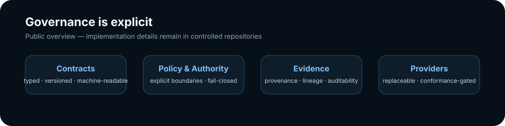

# MetaKernel

### Governed infrastructure for digital, agentic and physical systems

**Contract-first · Provider-neutral · Evidence-aware · Portable**

  <a href="#architecture">Architecture</a> ·
  <a href="#governance">Governance</a> ·
  <a href="#portability">Portability</a> ·
  <a href="#explore">Explore</a>

---

<strong>How to read the map</strong>

MetaKernel provides a common governed foundation. Workspace Runtime Infrastructure supplies a reusable operating boundary for people, agents, resources and environments. Domain Kernels add domain-specific contracts. Products and platforms are composed above those layers.

The diagram is intentionally high-level. Public documentation describes the product model and architectural boundaries without publishing proprietary implementation procedures, algorithms, internal resolution sequences or confidential design details.

<strong>Core public principles</strong>

- important resources have explicit identity, type, version and lifecycle;
- contracts, authority and policy boundaries are machine-readable;
- evidence, provenance and lineage are first-class concerns;
- providers remain replaceable behind defined interfaces;
- missing or unresolved mandatory state fails closed where required;
- domain systems are composed from governed, reusable infrastructure rather than hard-wired vendor dependencies.

<strong>Provider model</strong>

MetaKernel can bind to databases, model runtimes, agent frameworks, isolation systems, observability stacks, document processors, policy engines and other infrastructure through replaceable provider interfaces.

A provider being listed or available does **not** by itself mean it is trusted, active, production-conformant or authoritative. Conformance and deployment are separate concerns.

<strong>Deployment philosophy</strong>

The architecture is designed so the same governed model can be projected into hosted, sovereign, on-premises, edge and disconnected environments, subject to the capabilities and conformance requirements of each deployment profile.

## Explore

| Area | Public description |
|---|---|
| **MetaKernel** | shared governed infrastructure and canonical contracts |
| **Workspace Runtime Infrastructure** | reusable operating boundary for human, digital, agentic and physical resources |
| **Domain Kernels** | composable domain-specific contract and policy packs |
| **Products & Platforms** | governed applications, APIs, tools and infrastructure products |
| **Provider ecosystem** | replaceable infrastructure bindings with explicit conformance status |

> **Public disclosure boundary**
>
> This organization profile is a product and architecture overview, not a technical specification. Proprietary algorithms, internal state machines, implementation sequences, decision logic, optimization methods and confidential design material are maintained in controlled repositories and design documents.

---

**MetaKernel is under active development.**

