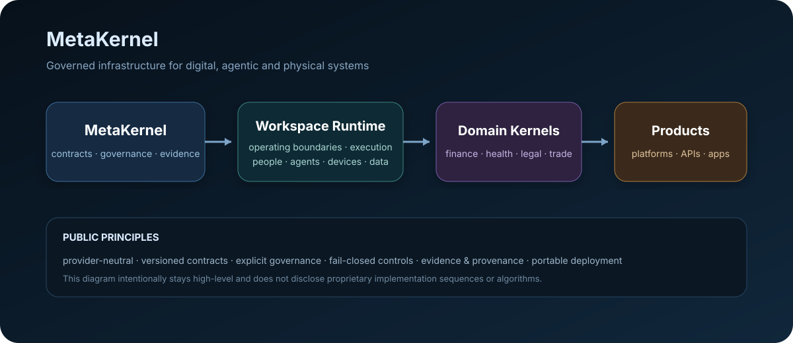

<div align="center">

# MetaKernel

### Governed infrastructure for digital, agentic and physical systems

**Provider-neutral · Contract-driven · Evidence-backed · Portable**

</div>

<p align="center">
  
</p>

<table>
<tr>
<td width="25%" align="center"><b>Governed</b><br/><sub>explicit authority, policy and lifecycle boundaries</sub></td>
<td width="25%" align="center"><b>Portable</b><br/><sub>hosted, sovereign, on-prem, edge and disconnected profiles</sub></td>
<td width="25%" align="center"><b>Verifiable</b><br/><sub>evidence, provenance, conformance and audit surfaces</sub></td>
<td width="25%" align="center"><b>Composable</b><br/><sub>shared kernel → domain kernels → governed products</sub></td>
</tr>
</table>

## Explore

<details open>
<summary><b>Architecture at a glance</b></summary>

```text
MetaKernel
   │
   ├── Workspace Runtime Infrastructure
   │
   ├── Domain Kernels
   │      ├── Finance
   │      ├── Healthcare
   │      ├── Legal / Regulatory
   │      └── Other governed domains
   │
   └── Products / Platforms / APIs / Apps
```

The public architecture stays intentionally high-level. MetaKernel defines common governance, contract, evidence and portability foundations while domain kernels add sector-specific semantics.

</details>

<details>
<summary><b>What MetaKernel is designed to support</b></summary>

- governed software and API products
- agent and tool runtimes
- physical/digital/hybrid workspaces
- regulated and evidence-sensitive workflows
- portable provider integrations
- domain-specific kernels and reusable infrastructure
- hosted, sovereign, on-premises, edge and disconnected deployment profiles

</details>

<details>
<summary><b>Public design principles</b></summary>

MetaKernel's public principles include explicit governance boundaries, canonical and versioned resources, provider-neutral infrastructure, deterministic or fail-closed behavior where required, evidence/provenance/auditability, and composable domain architecture.

External models, databases, policy systems, agent frameworks, browsers, document processors, observability systems and other engines remain replaceable behind MetaKernel-defined interfaces and conformance boundaries.

</details>

<details>
<summary><b>Repository model</b></summary>

| Area | Purpose |
|---|---|
| Core | shared MetaKernel contracts and implementation |
| Runtime | governed workspace and execution infrastructure |
| Domain kernels | sector-specific reusable kernels |
| Providers | replaceable integrations and adapters |
| Assurance | verification, conformance and evidence assets |
| Tooling | build, developer and operational tooling |

Repository availability varies by development stage.

</details>

## Public disclosure boundary

This profile is a **product and architecture overview**, not a technical specification. It intentionally does not publish proprietary algorithms, internal resolution procedures, implementation sequences, detailed state machines, private data models, optimization methods, model-training methods, or other confidential implementation details.

Detailed design and implementation material is maintained in controlled repositories and internal design records.

---

<div align="center">
<sub>MetaKernel is under active development.</sub>
</div>
